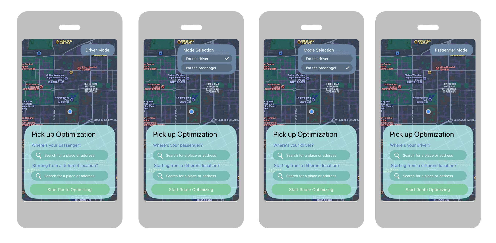

# Picking-Up Optimization

A tool for optimizing the process of a driver picking up a passenger.



## Problem

When a driver is on the way to pick someone up, the initially selected pickup point is not always the fastest option. Traffic conditions can change at any time across the route, and simply sticking to one fixed point can waste time for both parties.

## Solution

This software continuously analyzes real-time traffic conditions and re-calculates the fastest pickup strategy in all circumstances. It evaluates whether to keep the original pickup point or switch to a better alternative, while considering both driver travel time and passenger transfer time. The passenger can reach recommended points by walking, bicycle, or public transit. By dynamically selecting the best meeting point and route, overall pickup time is reduced for both the driver and the passenger.

## Features

- Continuous fastest-route recalculation for pickup under all traffic conditions
- Alternative pickup point suggestions with passenger mode options: walking, bicycle, and transit
- Joint route estimation for both driver and passenger, with ETA tradeoff comparison

## API

This project uses the [Amap (高德地图) API](https://lbs.amap.com/) for map data, real-time traffic information, and route planning.

---

> Contents below this line is for developers only.


Move to the [contribution guideline](https://github.com/oraoraoraaa/picking-up-optimization/blob/main/docs/GUIDELINE.md) to check contribution guideline.

This project contains detailed and clear documentations. Reading them using web-ui is recommended as it might not be a pleasant experience to read the tables in raw `.md` files.

## Notice

### V1 Vertical Slice Prototype

This repository now contains a working vertical slice prototype:

- Hardcoded passenger and driver locations
- Rust scoring across baseline + alternatives and walking/bicycle/transit modes
- Amap route/traffic fetching when `AMAP_KEY` is provided
- Top 3 ranked options displayed in the Flutter desktop app

#### Run It

1. Optional but recommended: set your Amap key.

```bash
export AMAP_KEY="your_amap_web_service_key"
```

2. Run the Flutter desktop app.

```bash
cd app/flutter
flutter run -d linux
```

The app triggers the Rust analyzer (`core`) via `cargo run --quiet` and renders top options. If Amap calls fail or no key is set, the prototype falls back to deterministic ETA estimation so the slice remains runnable.
