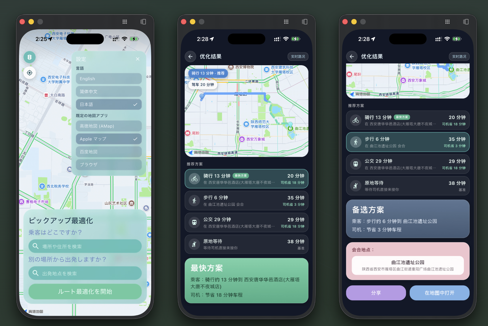

# Picking-Up Optimization 接驾优化

一个用于优化司机接载乘客流程的工具。



## 问题

当司机前往接载乘客时，最初选定的上车点未必总是最快的选择。沿途交通状况随时可能发生变化，若一味坚持在固定地点接人，可能会浪费双方的时间。

## 解决方案

该软件持续分析实时交通状况，并针对各种情况重新计算最优接载策略。它会综合考量司机行驶时间和乘客前往接载点所需的时间，从而评估是维持原定接载点，还是改用更优的替代方案。乘客可通过步行、骑行或乘坐公共交通工具前往推荐的接载点。通过动态选择最佳会合点与路线，系统缩短了司机和乘客各自的整体接载耗时。

## 功能特性

- 在各种交通状况下，持续重新计算前往上车点的最快路线
- 推荐备选上车点，并提供多种出行模式选项：步行、骑行及公共交通
- 综合估算司机与乘客的路线，并对比不同方案下的预计到达时间（ETA）

## API

本项目使用 [Amap（高德地图）API](https://lbs.amap.com/) 获取地图数据、实时路况信息及进行路线规划。

## 使用说明（需在 iOS / Android 物理机或模拟器运行）

进入 `app/flutter` 文件夹，传入高德地图的 API 密钥并编译运行：

```bash
cd app/flutter
export AMAP_ANDROID_KEY="<your_android_key>"
export AMAP_IOS_KEY="<your_ios_key>"
export AMAP_WEB_KEY="<your_web_service_key>"
flutter run \
  --dart-define=AMAP_ANDROID_KEY=$AMAP_ANDROID_KEY \
  --dart-define=AMAP_IOS_KEY=$AMAP_IOS_KEY \
  --dart-define=AMAP_WEB_KEY=$AMAP_WEB_KEY
```

在终端上允许相关权限后即可进行测试。
