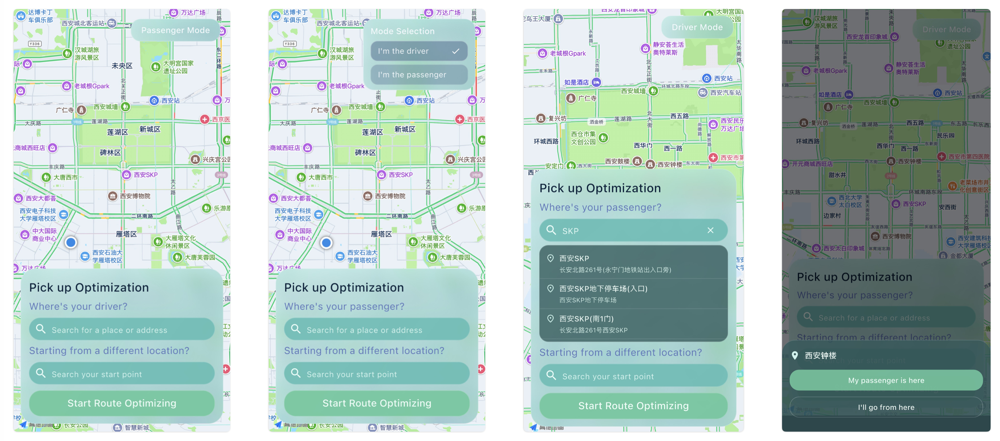

# Implementation Steps v1

This file contains the technical details of the implementation.

Whenever you add a new feature or make whatever modification, describe them in details and append this documentation.

## Dashboard UI

To display the dashboard:


We need:

- An interactive map in full screen as the bottom layer, showing the user's current location

  - Use `amap_map` package provided as a dart package. See `https://pub.dev/packages/amap_map`

- A small floating window on the upper right of the screen for current mode

  - When untouched, the window display the current mode, having two values: "Driver Mode" or "Passenger Mode"
  - When clicked, the window expand as a selection window, allowing the user to select the two modes

- A floating window on the bottom of the screen taking user input

  - In driver mode, the upper search bar would have the prompt: "Where is your passenger?"
  - In passenger mode, the upper search bar would have the prompt: "Where is your driver?"
  - The search function can be implemented using the `amap_map` package if available, or using the amap search API. See [`docs/amap/search_poi.md`](amap/search_poi.md)

### Implementation Update (2026-03-26)

Implemented a new dashboard-first UI in Flutter and set it as the application home screen.

File modified:

- `app/flutter/lib/main.dart`

Completed items:

- Replaced the previous vertical slice page with `DashboardPage` so the app directly opens the dashboard.
- Added a full-screen map layer placeholder using a `Stack` background:
  - A dark map-like gradient background.
  - A lightweight `CustomPainter` grid/route texture for visual structure.
  - A centered current-location marker icon.
- Added top-right floating mode selector:
  - Collapsed state shows either `Driver Mode` or `Passenger Mode`.
  - Tap expands into `Mode Selection` with two options:
    - `I'm the driver`
    - `I'm the passenger`
  - Current selection is shown with a check icon.
  - Selecting an option updates mode and collapses the selector.
- Added bottom floating input panel:
  - Panel title: `Pick up Optimization`.
  - Mode-aware primary prompt:
    - Driver mode: `Where's your passenger?`
    - Passenger mode: `Where's your driver?`
  - Two rounded search-bar UI placeholders with search icon and hint text.
  - `Start Route Optimizing` primary CTA button.

Notes:

- The search behavior is intentionally left as UI-only placeholder for now.
- The map is currently a visual placeholder layer to ensure the dashboard is displayable immediately.
- Next step is to replace the placeholder map with real `amap_map` integration and wire GPS/search interactions.

### Implementation Update (2026-03-26, AMap Integration)

Integrated `amap_map` into the dashboard so the app can render a real interactive map as the background and display the user's live location.

Files modified:

- `app/flutter/pubspec.yaml`
- `app/flutter/lib/main.dart`
- `app/flutter/android/app/src/main/AndroidManifest.xml`
- `app/flutter/ios/Runner/Info.plist`
- `app/flutter/ios/Podfile`

Completed items:

- Added dependencies:
  - `amap_map`
  - `x_amap_base`
  - `permission_handler`
- Replaced the custom-painted placeholder map layer in `DashboardPage` with `AMapWidget`.
- Added AMap SDK initialization and privacy agreement update:
  - `AMapInitializer.init(context, apiKey: ...)`
  - `AMapInitializer.updatePrivacyAgree(...)`
- Added map my-location visualization using `MyLocationStyleOptions(true, ...)`.
- Added `onLocationChanged` behavior to move camera to the first detected user location.
- Added Android permissions and compatibility flag for AMap runtime:
  - `ACCESS_COARSE_LOCATION`
  - `ACCESS_FINE_LOCATION`
  - `INTERNET`
  - `ACCESS_NETWORK_STATE`
  - `android:allowNativeHeapPointerTagging="false"`
- Added iOS location usage descriptions and ATS allowance in `Info.plist`.
- Added iOS `permission_handler` location compile flag in `Podfile`:
  - `PERMISSION_LOCATION=1`

API key configuration:

- AMap keys are currently injected through build-time defines:
  - `AMAP_ANDROID_KEY`
  - `AMAP_IOS_KEY`
- Example run pattern:

```bash
export AMAP_ANDROID_KEY="<your_android_key>"
export AMAP_IOS_KEY="<your_ios_key>"
flutter run \
  --dart-define=AMAP_ANDROID_KEY=$AMAP_ANDROID_KEY \
  --dart-define=AMAP_IOS_KEY=$AMAP_IOS_KEY
```

Notes:

- If keys are not provided (or app runs on unsupported platforms like web/desktop), dashboard falls back to a non-interactive gradient background with a setup hint card.
- Current location permission is requested via `permission_handler` (`locationWhenInUse`).

### Implementation Update (2026-03-26, Location-first Camera Focus)

Adjusted dashboard map behavior so camera focus procedure is strictly location-first:

- The map now stays behind a loading layer (`Fetching current location...`) until the first valid location callback is received.
- Once the first valid location is fetched, camera focus moves to user location via `CameraUpdate.newLatLngZoom(...)`.
- Only after that first focus update does the loading layer disappear.

Result:

- The user no longer sees the initial Beijing camera position before recentering.

### Implementation Update (2026-03-26, POI Search Suggestions and Selection)

Implemented interactive place search on both dashboard search bars with AMap suggestion APIs and map selection behavior.

Files modified:

- `app/flutter/lib/main.dart`
- `app/flutter/pubspec.yaml`

Completed items:

- Added `http` dependency for calling AMap Web Service APIs.
- Added two real input fields for the existing dashboard search bars:
  - Pickup target search (`Where's your passenger?` / `Where's your driver?`)
  - Alternate start point search (`Starting from a different location?`)
- Added debounced live search while typing:
  - Primary source: AMap Input Tips API (`/v3/assistant/inputtips`, `datatype=poi`)
  - Fallback source: AMap POI keyword search API (`/v3/place/text`)
- Added suggestion dropdown UI with consistent glass/teal visual style:
  - Loading state
  - Empty state
  - Error state
  - Tap-to-select list items showing name + address/district
- Added selection behavior:
  - Filling the tapped location into the corresponding input field
  - Closing suggestion panel
  - Moving map camera to selected location
  - Showing selected locations as markers on the AMap layer
- Added nearby-priority suggestion behavior by sending current user location to Input Tips when available.

API key behavior:

- Search requests use a dedicated build-time define first:
  - `AMAP_WEB_KEY`
- Fallback behavior when `AMAP_WEB_KEY` is missing:
  - Android uses `AMAP_ANDROID_KEY`
  - iOS uses `AMAP_IOS_KEY`

Recommended run pattern:

```bash
export AMAP_ANDROID_KEY="<your_android_key>"
export AMAP_IOS_KEY="<your_ios_key>"
export AMAP_WEB_KEY="<your_web_service_key>"
flutter run \
  --dart-define=AMAP_ANDROID_KEY=$AMAP_ANDROID_KEY \
  --dart-define=AMAP_IOS_KEY=$AMAP_IOS_KEY \
  --dart-define=AMAP_WEB_KEY=$AMAP_WEB_KEY
```

Notes:

- `amap_map` itself does not provide built-in POI autocomplete/search methods in `AMapController`, so search suggestions are implemented through AMap Web Service APIs.
- If no valid search key is configured, the suggestion panel displays a setup hint.

### Implementation Update (2026-03-26, Keyboard Dismissal & Interactive Map POI Selection)

Enhanced UX with keyboard dismissal and interactive map-based location selection.

Files modified:

- `app/flutter/lib/main.dart`

Completed items:

**Keyboard Dismissal:**
- Wrapped the main dashboard `Stack` in a `GestureDetector` with `onTap` handler.
- Calls `FocusScope.of(context).unfocus()` to dismiss keyboard when user taps outside search inputs.
- Result: Keyboard closes automatically when clicking on map or other UI elements.

**Interactive Map POI Selection:**
- Enabled POI tap detection on `AMapWidget`:
  - Set `touchPoiEnabled: true` to allow POI tapping.
  - Registered `onPoiTouched` callback to capture tapped locations.
- Implemented map POI tap handler (`_onMapPoiTapped`):
  - Dismisses keyboard via `FocusScope.unfocus()`.
  - Triggers bottom sheet modal.
- Created context-aware bottom sheet (`_showPoiSelectionBottomSheet`):
  - Displays POI name as header.
  - Shows two mode-specific action buttons:
    - **Driver Mode**: "My passenger is here" (set as pickup) + "I'll go from here" (set as start).
    - **Passenger Mode**: "My driver is here" (set as pickup) + "I'm here" (set as start).
  - Buttons close bottom sheet after selection and trigger marker refresh.
- Added POI selection handlers (`_setPickupFromPoi`, `_setStartFromPoi`):
  - Creates `_PoiSuggestion` object from tap coordinates (using POI name, id, latLng).
  - Updates corresponding controller text (pickup/start input field).
  - Refreshes map markers to show selected location.
  - Clears active search field state.

Technical Notes:

- `AMapPoi` class from `amap_map` package contains only: `name`, `id`, `latLng` properties.
- No address/district information is available from map POI taps, so these fields are set to empty strings in the selection model.
- If address information is needed from map taps, a reverse geocoding API call would be required (separate implementation).
- Bottom sheet only displays POI name without subtitle (address unavailable).

### Implementation Results (2026-03-26)



### Implementation Update (2026-03-27, Smooth Interaction Animations)

Added smooth transitions across dashboard interactive widgets so state changes feel continuous instead of abrupt.

Files modified:

- `app/flutter/lib/main.dart`

Completed items:

- Added shared animation timing constants for consistent motion across widgets.
- Enhanced top-right mode selector animation:
  - Wrapped selector with `AnimatedSize` for smooth size interpolation.
  - Added `AnimatedSwitcher` + fade/scale transition between collapsed and expanded states.
  - Preserved selection behavior while making expansion/collapse feel fluid.
- Enhanced mode option selection animation:
  - Replaced static option container with `AnimatedContainer` so selected/unselected background and border transition smoothly.
  - Added `AnimatedSwitcher` for check icon appearance/disappearance.
- Enhanced bottom prompt transition:
  - Wrapped mode-dependent prompt text with `AnimatedSwitcher` using fade + slide transition when switching Driver/Passenger mode.
- Enhanced search bar interaction animation:
  - Replaced static search field shell with `AnimatedContainer`.
  - Added active-state transitions (subtle glow, stronger border, slightly stronger fill) when field is focused/active.
  - Added `AnimatedSwitcher` for trailing search action (loading spinner / clear button / empty placeholder).
- Enhanced map loading overlay transition:
  - Replaced hard show/hide with `AnimatedSwitcher` so the initial location-loading overlay fades out smoothly after first location lock.

Notes:

- Existing interaction logic (mode changes, search behavior, marker updates, POI bottom sheet actions) remains unchanged.
- This update is purely UX motion polish, designed to improve perceived responsiveness without changing business behavior.
