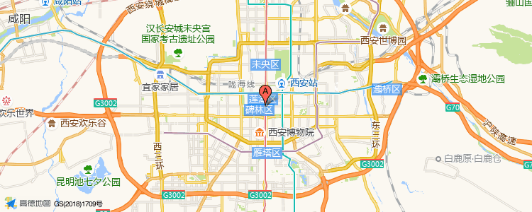

# Static Map

> This document is mostly copied from the webpage: `https://lbs.amap.com/api/webservice/guide/api/staticmaps/`.
>
> For more detailed information, visit the website.
>
> For querying adcode or city code, see [`docs/amap/adcode_citycode.csv`](adcode_citycode.csv).
>
> For querying poi categories or poi code, see [`docs/amap/poi_code.csv`](poi_code.csv).

## Introduction

The static map service responds to HTTP requests by returning a map image, allowing users to embed Amap maps as images in their own web pages. Users can specify the map location, image size, and add overlays such as labels, markers, polylines, and polygons to the map.

## Static Map: Request

- URL: `https://restapi.amap.com/v3/staticmap?parameters`
- 请求方式：GET

`parameters` 代表的参数包括必填参数和可选参数。所有参数均使用和号字符(&)进行分隔。下面的列表枚举了这些参数及其使用规则。

| 参数名称 | 含义         | 规则说明                                                                                     | 是否必须   | 默认值  |
|----------|--------------|----------------------------------------------------------------------------------------------|------------|---------|
| key      | 用户唯一标识 | 用户在高德地图官网申请                                                                         | 必填       | 无      |
| location | 地图中心点   | 中心点坐标。<br>规则：经度和纬度用","分隔 经纬度小数点后不得超过6位。                         | 部分条件必填 | 无      |
| zoom     | 地图级别     | 地图缩放级别:[1,17]                                                                           | 必填       | 无      |
| size     | 地图大小     | 图片宽度*图片高度。最大值为1024*1024                                                          | 可选       | 400*400 |
| scale    | 普通/高清    | 1:返回普通图;<br>2:调用高清图，图片高度和宽度都增加一倍，zoom也增加一倍(当zoom为最大值时，zoom不再改变)。 | 可选       | 1       |
| markers  | 标注         | 使用规则见markers详细说明，标注最大数10个                                                      | 可选       | 无      |
| labels   | 标签         | 使用规则见labels详细说明，标签最大数10个                                                       | 可选       | 无      |
| paths    | 折线         | 使用规则见paths详细说明，折线和多边形最大数4个                                                 | 可选       | 无      |
| traffic  | 交通路况标识 | 底图是否展现实时路况。可选值：0，不展现；1，展现。                                             | 可选       | 0       |
| sig      | 数字签名     | 数字签名认证用户必填                                                                           | 可选       | 无      |

注意：如果有标注/标签/折线等覆盖物，则中心点（location）和地图级别（zoom）可选填。当请求中无 location 值时，地图区域以包含请求中所有的标注/标签/折线的几何中心为中心点；如请求中无 zoom，地图区域以包含请求中所有的标注/标签/折线为准，系统计算出 zoom 值。

### `markers` Usage

Format:

```text
markers=markersStyle1:location1;location2..|markersStyle2:location3;location4..|markersStyleN:locationN;locationM.. 
```

location 为经纬度信息，经纬度之间使用","分隔，不同的点使用";"分隔。 markersStyle 可以使用系统提供的样式，也可以使用自定义图片。

系统 markersStyle：size，color，label

| markersStyle（参数名称） | 说明                                                                                                                                                                 | 默认值    |
|--------------------------|----------------------------------------------------------------------------------------------------------------------------------------------------------------------|-----------|
| size                     | 可选值： small,mid,large                                                                                                                                                | small     |
| color                    | 选值范围：[0x000000, 0xffffff]<br>例如：<br>0x000000 black,<br>0x008000 green,<br>0x800080 purple,<br>0xFFFF00 yellow,<br>0x0000FF blue,<br>0x808080 gray,<br>0xffa500 orange,<br>0xFF0000 red,<br>0xFFFFFF white | 0xFC6054  |
| label                    | [0-9]、[A-Z]、[单个中文字] 当 size 为 small 时，图片不展现标注名。                                                                                                       | 无        |

#### `markers` Usage: Example

- Default `markers`: `https://restapi.amap.com/v3/staticmap?markers=mid,0xFF0000,A:116.37359,39.92437;116.47359,39.92437&key=<YOUR_KEY>`
- Custom `markers`: `https://restapi.amap.com/v3/staticmap?markers=-1,https://a.amap.com/jsapi_demos/static/demo-center/icons/poi-marker-default.png,0:116.37359,39.92437&key=<YOUR_KEY>`

> 自定义markersStyle： -1，url，0。
>
> -1表示为自定义图片，URL 为图片的网址。自定义图片只支持 PNG 格式。

### `labels` Usage

Format:

```text
labels=labelsStyle1:location1;location2..|labelsStyle2:location3;location4..|labelsStyleN:locationN;locationM.. 
```

location 为经纬度信息，经纬度之间使用","分隔，不同的点使用";"分隔。

labelsStyle：label, font, bold, fontSize, fontColor, background。 各参数使用","分隔，如有默认值则可为空。

| labelsStyle（参数名称） | 说明                                                                 | 默认值     |
|-------------------------|----------------------------------------------------------------------|------------|
| content                 | 标签内容，字符最大数目为15                                           | 无         |
| font                    | 0：微软雅黑；<br>1：宋体；<br>2：Times New Roman；<br>3：Helvetica | 0          |
| bold                    | 0：非粗体；<br>1：粗体                                               | 0          |
| fontSize                | 字体大小，可选值[1,72]                                               | 10         |
| fontColor               | 字体颜色，取值范围：[0x000000, 0xffffff]                             | 0xFFFFFF   |
| background              | 背景色，取值范围：[0x000000, 0xffffff]                               | 0x5288d8   |

#### `labels` Usage: Example

`https://restapi.amap.com/v3/staticmap?location=116.48482,39.94858&zoom=10&size=400*400&labels=朝阳公园,2,0,16,0xFFFFFF,0x008000:116.48482,39.94858&key=<YOUR_KEY>`

### `paths` Usage

Format:

```text
paths=pathsStyle1:location1;location2..|pathsStyle2:location3;location4..|pathsStyleN:locationN;locationM.. 
```

location 为经纬度，经纬度之间使用","分隔，不同的点使用";"分隔。

pathsStyle：weight, color, transparency, fillcolor, fillTransparency

| pathsStyle（参数名称） | 说明                                                                                                   | 默认值    |
|------------------------|--------------------------------------------------------------------------------------------------------|-----------|
| weight                 | 线条粗细。<br>可选值：[2,15]                                                                             | 5         |
| color                  | 折线颜色。选值范围：[0x000000, 0xffffff]<br>例如：<br>0x000000 black,<br>0x008000 green,<br>0x800080 purple,<br>0xFFFF00 yellow,<br>0x0000FF blue,<br>0x808080 gray,<br>0xffa500 orange,<br>0xFF0000 red,<br>0xFFFFFF white | 0x0000FF  |
| transparency           | 透明度。<br>可选值[0,1]，小数后最多2位，0表示完全透明，1表示完全不透明。                                 | 1         |
| fillcolor              | 多边形的填充颜色，此值不为空时折线封闭成多边形。取值规则同color                                           | 无        |
| fillTransparency       | 填充面透明度。<br>可选值[0,1]，小数后最多2位，0表示完全透明，1表示完全不透明。                           | 0.5       |

#### `paths` Usage: Example

`https://restapi.amap.com/v3/staticmap?zoom=15&size=500*500&paths=10,0x0000ff,1,,:116.31604,39.96491;116.320816,39.966606;116.321785,39.966827;116.32361,39.966957&key=<YOUR_KEY>`

## Static Map: Example

```sh
https://restapi.amap.com/v3/staticmap?location=108.94703,34.25943&zoom=10&size=750*300&markers=mid,,A:108.94703,34.25943&key=<用户的key>
```

Return value: See [`docs/amap/static_map.png`](static_map.pn).


