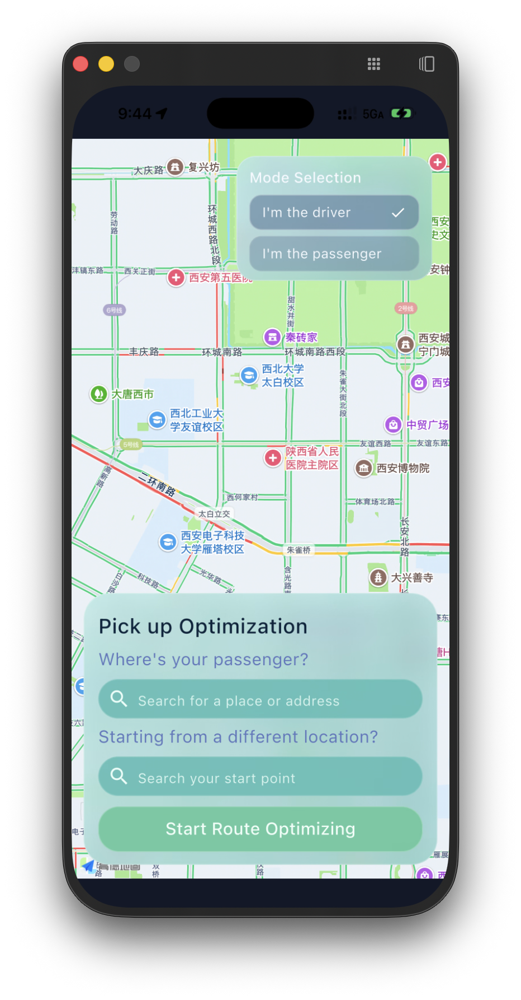
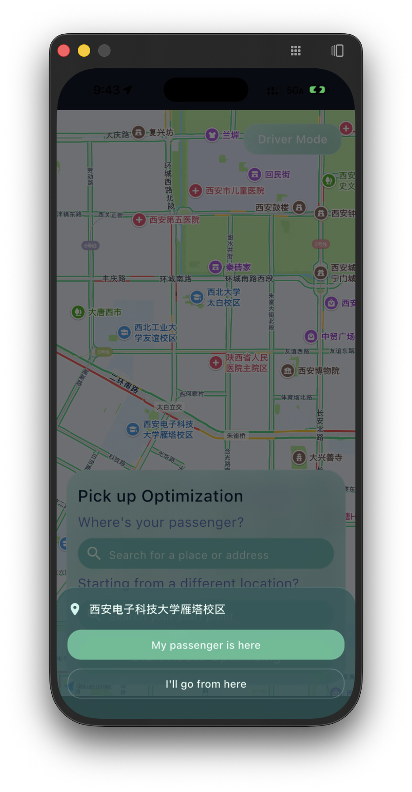
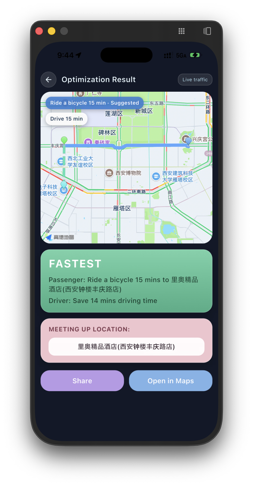
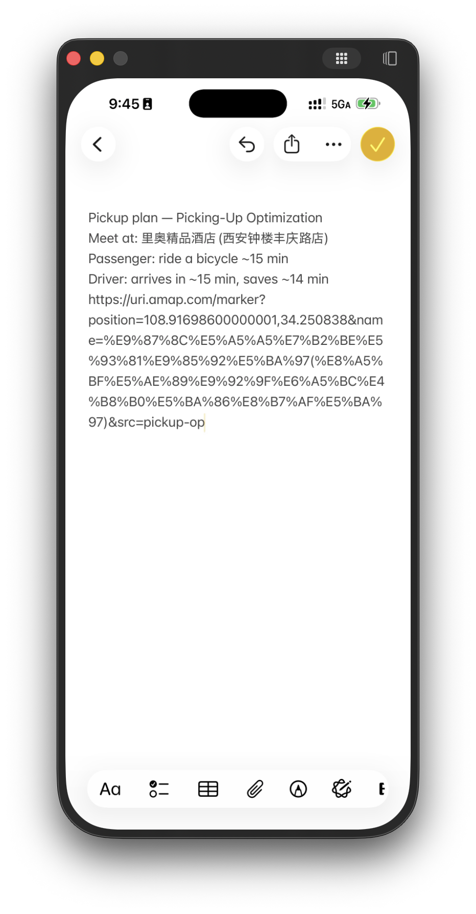
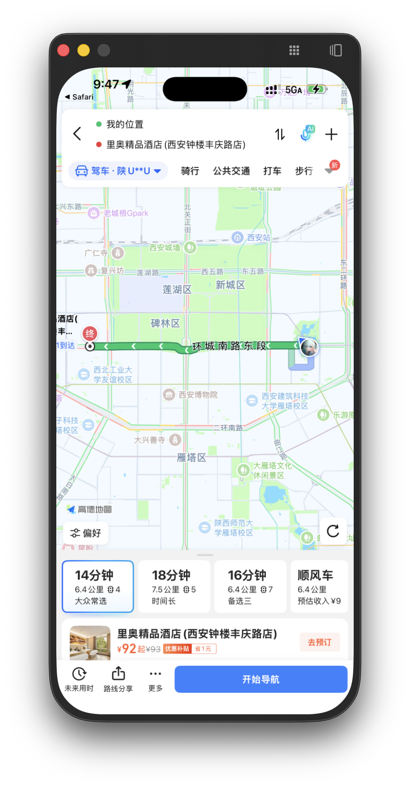
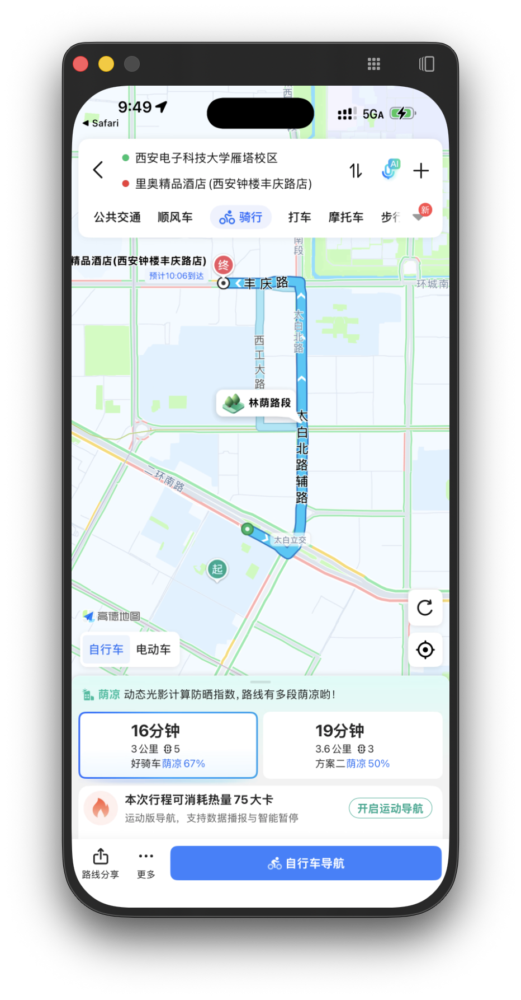

# 接驾优化（Picking-Up Optimization）Demo V1 项目报告

> 日期：2026-06-10
>
> 仓库：`picking-up-optimization` · 演示环境：iPhone 16 Pro Max 真机（西安市实地测试）

本项目旨在解决网约车/私人接驾场景中的一个常见痛点：司机前往接乘客时，最初选定的上车点并不总是最快的方案。本软件基于实时路况持续计算最优接驾策略，在"原地等待"与"前往更优会合点"之间做出推荐，同时兼顾司机行车时间与乘客（步行/骑行/公交）的移动成本。

---

## 一、项目亮点

### 1. 自研"路线拦截"（Route-Interception）优化算法

Demo 的核心不是简单调用地图 API，而是实现了一个完整的会合点优化算法（v1）：

1. 获取司机驶向乘客的完整驾车路线，并按各路段时长比例为路线上每个顶点计算累计行车时间；
2. 沿该路线生成候选会合点——只保留乘客可达（步行 ≤ 1.2 km / 骑行 ≤ 3.5 km / 公交 2–8 km）、移动有意义（≥ 120 m）、且能为司机节省 ≥ 60 s 车程的顶点，再按 ≥ 250 m 间距稀疏化并均匀降采样至最多 4 个，以控制 API 调用量；
3. 对每个"候选点 × 出行方式"组合加权打分：

   ```text
   score = max(司机ETA, 乘客ETA) + 0.15 × 乘客ETA + 方式惩罚（骑行 +1.0 min，公交 +2.5 min）
   ```

4. 升序排序（平分时优先乘客负担更小、再优先司机 ETA 更小的方案），且胜出方案必须比"乘客原地等待"基线快至少 1.5 分钟，否则推荐保持原上车点——保证推荐永远不比不优化更差。

### 2. Rust 核心引擎 + Flutter 跨端应用的分层架构

- **Rust core**（`core/`）：领域模型（`domain.rs`）、纯函数算法引擎（`engine.rs`，10 个单元测试全部通过）、高德 API 适配层（`amap.rs`）与编排器（`lib.rs`），并提供可独立运行的 CLI（支持内置场景 / 文件 / stdin 输入，输出 JSON 推荐集）；
- **Flutter App**（`app/flutter/`）：仪表盘（实时地图、模式切换、POI 搜索）、优化服务与结果页，`flutter analyze` 零问题、6 个测试全部通过。

### 3. 高德开放平台能力的深度整合

单一 Demo 内串联了高德地图 SDK（实时路况渲染、定位、POI 点选）与 Web 服务 API（输入提示、关键字搜索、驾车/步行/骑行/公交路径规划、逆地理编码），并将逆地理编码用于把算法输出的坐标转换为人类可读的会合点名称（优先附近 POI 名）。

### 4. 全链路降级设计，演示"永不白屏"

任何一级失败（未配置 Key、网络超时、接口报错）都会退化为确定性估算（直线插值路线 + 分方式速度模型），结果页以徽标明确标注数据来源：`Live traffic` / `Live + estimates` / `Estimates only`，既保证可演示性，又不掩盖数据质量。

### 5. 真机实测闭环验证（本报告第二节附数据）

不止于"界面能跑"，我们用高德导航对推荐结果做了交叉验证：直接开车接乘客需 **28 分钟**，按推荐方案双方会合仅需约 **16 分钟**，节省约 **12 分钟（≈43%）**，与 App 内推荐值吻合。

---

## 二、原定计划与实际成果

### 1. 原定计划（见 `docs/PLAN.md`）

| 计划项 | 内容 |
| --- | --- |
| 垂直切片 | 硬编码地点 + Amap 取数 + Rust 评分 + 桌面端展示 Top 3 |
| 系统架构 | Rust Core / 基础设施适配层 / Flutter App 分层，`flutter_rust_bridge` 通信 |
| 优化引擎 | 候选点生成、加权目标函数、排序与解释性元数据 |
| Amap 集成 | 各路径规划接口客户端、限流重试缓存 |
| 测试策略 | Rust 单测 + 桥接契约测试 + Flutter widget 测试 |

### 2. 实际成果

**已完成并超出垂直切片范围：**

- ✅ 仪表盘 UI：全屏实时地图（含路况）、司机/乘客双模式、POI 搜索建议与地图点选、动效打磨；
- ✅ 优化算法 v1 在 Rust core 中完整落地（候选生成 / 评分 / 排序 / stay-put 决策），纯函数实现 + 10 个单元测试，并升级为"库 + CLI"结构，输入不再硬编码；
- ✅ 结果页严格按设计稿 `result_v1.png` 实现：路线预览图（司机蓝色实线 + 乘客绿色虚线 + 三类标记 + 视野自适应）、`FASTEST` 摘要卡、`MEETING UP LOCATION` 卡、`Share` 与 `Open in Maps`；
- ✅ 端到端流程跑通：搜索/点选 → 一键优化 → 结果展示 → 分享/跳转高德。

**完整 Demo 流程（真机截图）：**

| | |
| :---: | :---: |
|  |  |
| 图 1：首页仪表盘（司机模式，实时路况） | 图 2：模式选择浮窗 |
|  |  |
| 图 3：地图点选 POI 设定乘客位置（西安电子科技大学雁塔校区） | 图 4：优化计算中（拉取路况与候选会合点） |
|  |  |
| 图 5：结果页——推荐乘客骑行 15 分钟至"里奥精品酒店(西安钟楼丰庆路店)"，司机节省 14 分钟车程 | 图 6：Share 复制的方案摘要（含高德链接） |

| |
| :---: |
|  |
| 图 7：Open in Maps 跳转高德，定位会合点 |

**实测验证（高德导航交叉对比）：**

| | | |
| :---: | :---: | :---: |
|  |  |  |
| 图 8：不优化——司机直接开到乘客处需 **28 分钟** | 图 9：优化后——司机开到会合点仅 **14 分钟** | 图 10：乘客骑行至会合点 **16 分钟** |

优化后整体完成时间 ≈ max(14, 16) = **16 分钟**，对比基线 28 分钟节省约 **12 分钟**；高德实测值与 App 推荐值（司机省 14 分钟、骑行约 15 分钟）高度一致，验证了算法与数据链路的正确性。

### 3. 与计划的差异

| 差异项 | 说明 |
| --- | --- |
| FFI 桥未接通 | 计划使用 `flutter_rust_bridge`，本期 App 端以 **Dart 镜像引擎**（`pickup_optimizer.dart`，与 `core/src/engine.rs` 公式、常量逐项对照注释）在设备上运行算法。原因：FFI 涉及 iOS/Android 原生构建链改造，无法在不破坏现有真机演示的前提下充分验证，故列为下一步首要事项 |
| 弹性策略简化 | 限流、指数退避重试、熔断、缓存等未实现，目前以"超时 + 确定性降级"覆盖演示需求 |
| 候选点来源 | 候选点取自驾车路线折线顶点，尚未结合 POI 检索筛选"适合停车上客"的语义化地点 |
| 展示范围 | 结果页按设计稿仅展示最优方案；引擎已输出 Top 2 备选方案（CLI 可见），UI 暂未呈现 |

---

## 三、结论和体会

### 结论

1. **"沿司机路线找会合点"这一核心思路被实测验证有效**：在西安晚高峰路况下，端到端接驾时间从 28 分钟降至约 16 分钟。该收益来源清晰——乘客的低速短途移动换掉了司机在拥堵路段的高成本绕行；
2. **Demo V1 已具备完整产品闭环**：选点 → 优化 → 推荐 → 分享/导航，且在无 Key、无网络场景下可降级运行；
3. **架构验证达标**：算法以纯函数沉淀在 Rust core 中、可独立测试与 CLI 复现，UI 与引擎边界清晰，为后续 FFI 接入和算法迭代打好了基础。

### 体会

- **垂直切片先行是正确决策**：先用最小链路打通"取数—评分—展示"，再逐层替换为真实组件，每一步都有可演示物，风险被持续压低；
- **纯函数引擎 = 可测试性红利**：候选生成、评分、决策完全无 I/O，10 个单测覆盖了间距/可达性/平分决胜/stay-put 等关键不变量，调参时心里有底；
- **降级链路值得在第一天就设计**：真机演示现场网络与配额不可控，"永远给出确定性结果 + 如实标注数据来源"避免了演示翻车，也是产品诚实性的体现；
- **跨语言双实现的同步成本真实存在**：Rust 参考实现与 Dart 镜像虽以注释互相锚定、测试互为镜像，但本质上是技术债——这直接把 FFI 桥的优先级提到了下期首位；
- **决策规则比打分公式更重要**：引入"必须比原地等待快 1.5 分钟才推荐改点"的门槛后，系统从"总想让乘客挪地方"变成"只在确有收益时打扰用户"，体验差异显著。

---

## 四、项目期间的外延拓展

围绕 Demo 主线，本期还沉淀了一批超出单次演示价值的工程资产：

1. **Rust core CLI 化**：引擎可脱离 App 独立运行（内置场景 / 文件 / stdin 三种输入，JSON 输出），为后续回放测试（golden scenario）、参数标定与服务端化预留了入口；
2. **高德 API 知识库**：`docs/amap/` 下整理了路径规划（驾车/步行/骑行/公交）、POI 搜索、地理/逆地理编码、静态地图等接口文档与真实返回样例，可直接复用至后续开发；
3. **测试基建**：结果页通过 `runOptimization` 注入点实现了无网络、无平台通道依赖的 widget 测试；Dart 引擎测试与 Rust 引擎测试互为镜像，形成跨语言一致性的回归防线；
4. **跨平台可运行性**：桌面端（macOS 已验证构建通过）在缺少地图 SDK 时以 `CustomPainter` 将真实折线几何投影为示意路线图，保证开发调试不依赖真机；同时补齐了 macOS release 沙盒的网络访问 entitlement；
5. **工程规范沉淀**：遵循 Conventional Commits 与分支保护流程，`docs/IMPLEMENTATION.md` 以"实现更新日志"形式持续记录每次改动的文件、行为与验证方式，新成员可按文档完整复现项目状态；
6. **开发环境补全**：补装 Rust stable 工具链；定位并记录了本机 Xcode 缺少 iOS 26.2 平台组件导致 `flutter build ios` 本地受阻的问题（不影响真机演示，属环境问题）。

**下一步规划**（按优先级）：接通 `flutter_rust_bridge` 让 Rust 引擎直接在端上运行、候选点结合 POI 检索升级为语义化地点、UI 呈现 Top N 备选方案、引入行程中的持续重算（continuous recalculation）。

---

*附：本报告所有截图位于 `report/demo-v1/images/`，均为 iPhone 真机实拍。*
