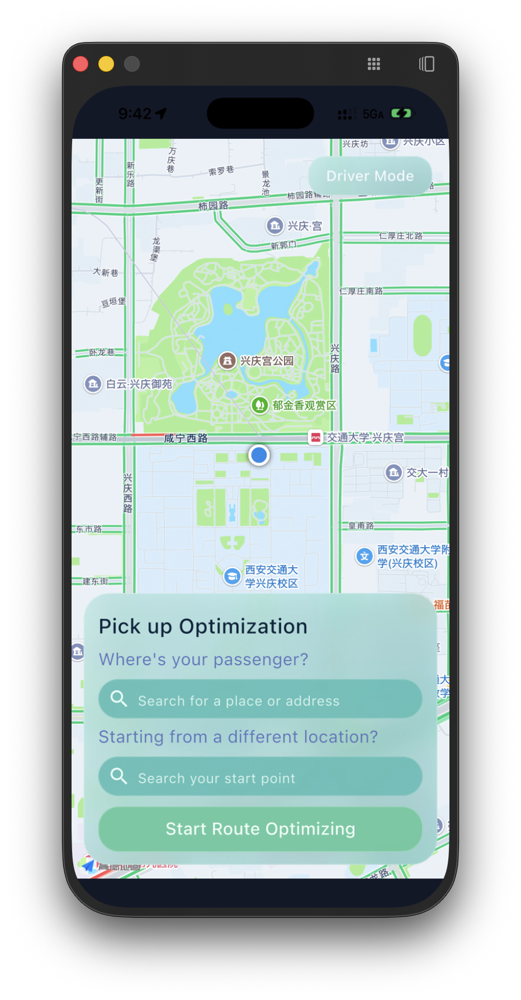
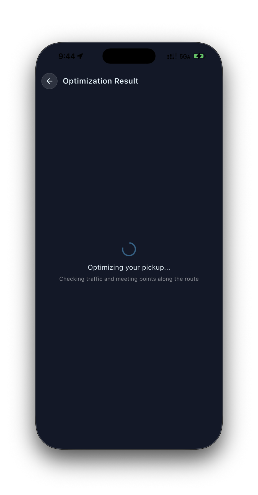
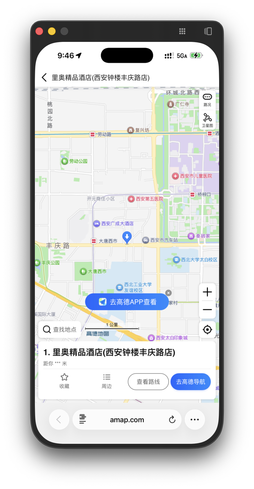
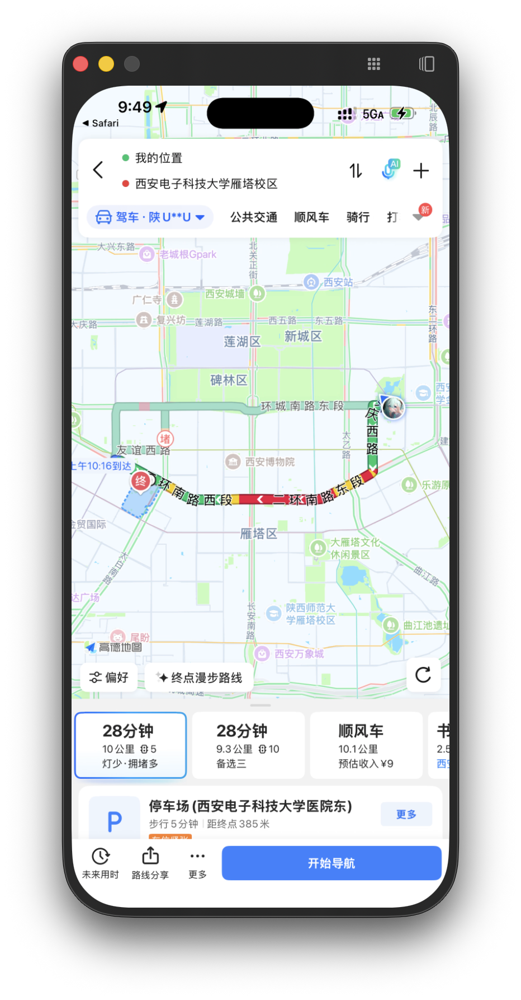
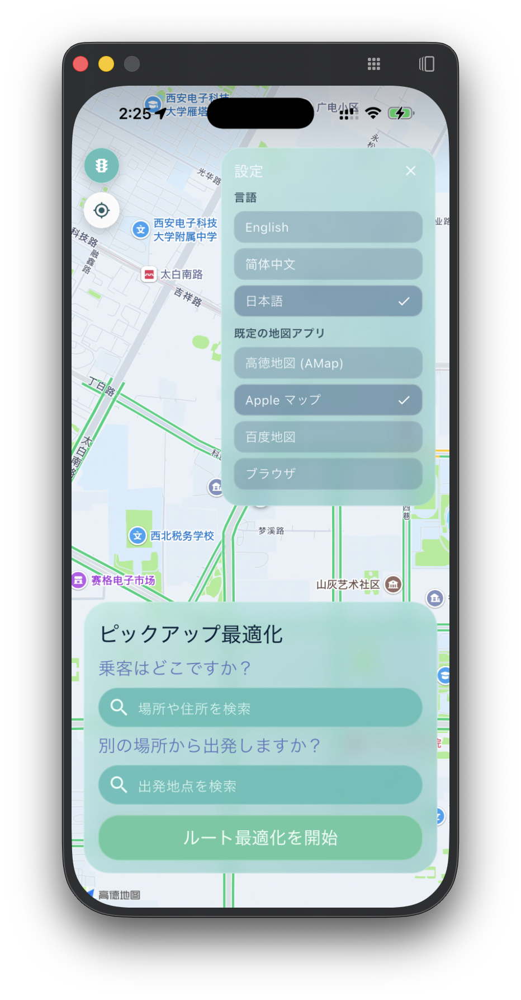
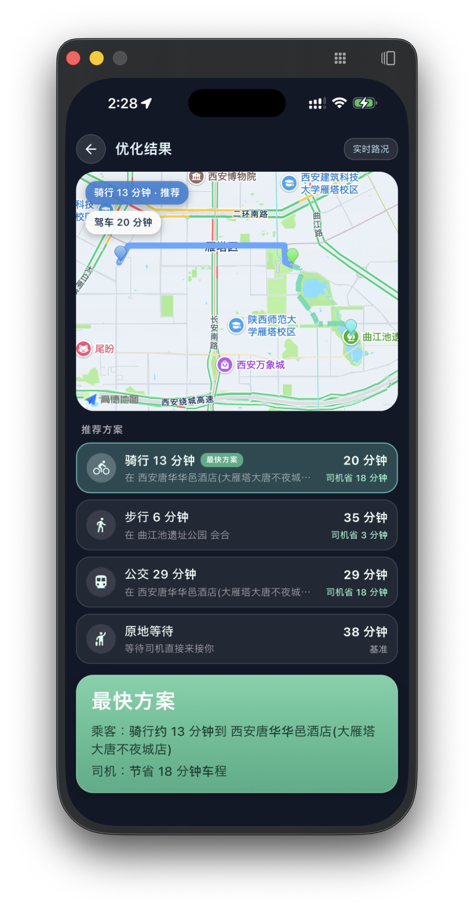
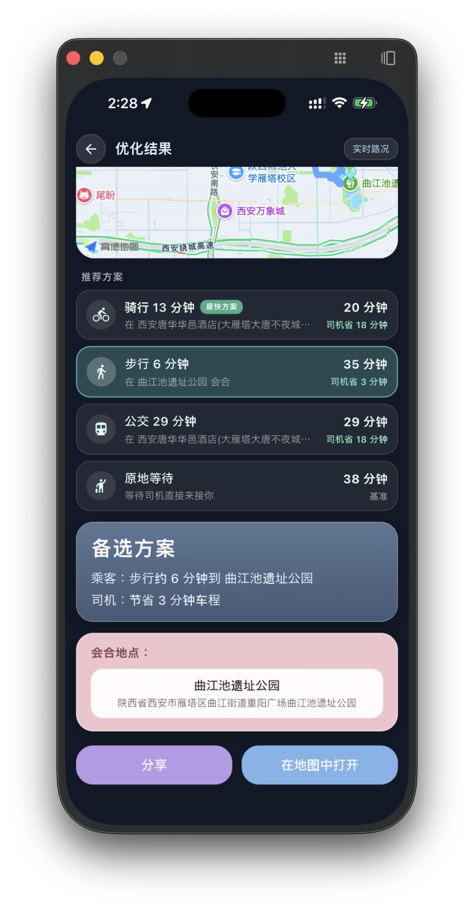

# 接驾优化（Picking-Up Optimization）Demo V2 项目报告

> 日期：2026-06-10
>
> 仓库：`picking-up-optimization` · 演示环境：iPhone 16 Pro Max 真机（西安市实地测试）
>
> 说明：按要求，本报告完整保留 Demo V1 报告的全部内容（对已发生变化之处进行了修订），并在各章节追加 V2 新增特性。V1 截图位于 `report/demo-v1/images/`，V2 截图位于 `report/demo-v2/images/`。

本项目旨在解决网约车/私人接驾场景中的一个常见痛点：司机前往接乘客时，最初选定的上车点并不总是最快的方案。本软件基于实时路况持续计算最优接驾策略，在"原地等待"与"前往更优会合点"之间做出推荐，同时兼顾司机行车时间与乘客（步行/骑行/公交）的移动成本。

---

## 一、项目亮点

### 1. 自研"路线拦截"（Route-Interception）优化算法

Demo 的核心不是简单调用地图 API，而是实现了一个完整的会合点优化算法：

1. 获取司机驶向乘客的完整驾车路线，并按各路段时长比例为路线上每个顶点计算累计行车时间；
2. 沿该路线生成候选会合点——只保留乘客可达（步行 ≤ 1.2 km / 骑行 ≤ 3.5 km / 公交 2–8 km）、移动有意义（≥ 120 m）、且能为司机节省 ≥ 60 s 车程的顶点，再按 ≥ 250 m 间距稀疏化并均匀降采样至最多 4 个，以控制 API 调用量；
3. 对每个"候选点 × 出行方式"组合加权打分：

   ```text
   score = max(司机ETA, 乘客ETA) + 0.15 × 乘客ETA + 方式惩罚（骑行 +1.0 min，公交 +2.5 min）
   ```

4. 升序排序（平分时优先乘客负担更小、再优先司机 ETA 更小的方案），且胜出方案必须比"乘客原地等待"基线快至少 1.5 分钟，否则推荐保持原上车点——保证推荐永远不比不优化更差。

**V2 新增**：引擎在排序结果上增加 `best_per_mode` 归约——在保持总排名次序的前提下，为步行 / 骑行 / 公交各保留该方式下得分最优的一个方案，连同"原地等待"基线一起输出；每个方案自带各自的 ETA、节省时间与司机/乘客路线折线，且全集中**有且仅有一个**方案被标记为 `recommended`（仍由 1.5 分钟改善门槛裁决）。骑行路径也接入了高德骑行路径 API 的真实折线（此前仅步行有真实路径）。

### 2. Rust 核心引擎 + Flutter 跨端应用的分层架构

- **Rust core**（`core/`）：领域模型（`domain.rs`）、纯函数算法引擎（`engine.rs`，V2 现有 12 个单元测试全部通过）、高德 API 适配层（`amap.rs`）与编排器（`lib.rs`），并提供可独立运行的 CLI（支持内置场景 / 文件 / stdin 输入，输出 JSON 推荐集）；
- **Flutter App**（`app/flutter/`）：仪表盘（实时地图、模式切换、POI 搜索）、优化服务与结果页，`flutter analyze` 零问题、V2 现有 13 个测试全部通过。

### 3. 高德开放平台能力的深度整合

单一 Demo 内串联了高德地图 SDK（实时路况渲染、定位、POI 点选）与 Web 服务 API（输入提示、关键字搜索、驾车/步行/骑行/公交路径规划、逆地理编码），并将逆地理编码用于把算法输出的坐标转换为人类可读的会合点名称（优先附近 POI 名）。

**V2 新增**：在 SDK/Web API 之外，进一步打通了**端上应用间跳转**——"在地图中打开"通过 URL Scheme 深度链接直接唤起高德地图 / Apple 地图 / 百度地图原生 App（百度链接显式声明 `coord_type=gcj02` 避免坐标偏移），未安装时自动回退到网页版标记页。

### 4. 全链路降级设计，演示"永不白屏"

任何一级失败（未配置 Key、网络超时、接口报错）都会退化为确定性估算（直线插值路线 + 分方式速度模型），结果页以徽标明确标注数据来源：`Live traffic` / `Live + estimates` / `Estimates only`，既保证可演示性，又不掩盖数据质量。

### 5. 真机实测闭环验证（本报告第二节附数据）

不止于"界面能跑"，我们用高德导航对推荐结果做了交叉验证：V1 实测直接开车接乘客需 **28 分钟**，按推荐方案双方会合仅需约 **16 分钟**，节省约 **12 分钟（≈43%）**，与 App 内推荐值吻合。V2 多方案场景下（见图 13）基线 38 分钟 vs 推荐骑行方案 20 分钟，节省约 **18 分钟（≈47%）**。

### 6. 多语言与本地化体验（V2 新增）

App 支持 **English / 简体中文 / 日本語** 三语即时切换：自研轻量字符串表（每条文案以 `_t(en, zh, ja)` 三元组维护，约 70 条），通过 `InheritedNotifier` 作用域下发，切换语言时全界面即时刷新、无需重启；首次启动自动跟随系统语言，选择结果持久化保存。

### 7. 原生设置面板与默认地图应用（V2 新增）

主屏右上角新增"三横线"设置入口，展开为玻璃拟态设置面板：语言选择 + 默认地图应用（高德 / Apple 地图 / 百度 / 浏览器，按平台过滤），所有选项即点即生效并以 `shared_preferences` 持久化。

---

## 二、原定计划与实际成果

### 1. 原定计划

V1 阶段计划（见 `docs/PLAN.md`）：

| 计划项 | 内容 |
| --- | --- |
| 垂直切片 | 硬编码地点 + Amap 取数 + Rust 评分 + 桌面端展示 Top 3 |
| 系统架构 | Rust Core / 基础设施适配层 / Flutter App 分层，`flutter_rust_bridge` 通信 |
| 优化引擎 | 候选点生成、加权目标函数、排序与解释性元数据 |
| Amap 集成 | 各路径规划接口客户端、限流重试缓存 |
| 测试策略 | Rust 单测 + 桥接契约测试 + Flutter widget 测试 |

V2 阶段新增需求：

| 需求项 | 内容 |
| --- | --- |
| 多方案展示 | 结果页呈现步行 / 骑行 / 公交多条建议（含核心引擎配套改造） |
| 多语言 | 支持简体中文与日语切换 |
| 原生地图跳转 | "在地图中打开"唤起手机上的默认地图 App（而非浏览器），并提供默认地图应用设置 |
| 设置入口 | 主屏右上角"三横线"图标，点击展开上述设置 |
| 体验修复 | 主屏上下黑边、结果页地图无法拖动、整体动效与性能优化 |

### 2. 实际成果

#### V1 阶段成果（完整保留）

**已完成并超出垂直切片范围：**

- ✅ 仪表盘 UI：全屏实时地图（含路况）、司机/乘客双模式、POI 搜索建议与地图点选、动效打磨；
- ✅ 优化算法 v1 在 Rust core 中完整落地（候选生成 / 评分 / 排序 / stay-put 决策），纯函数实现 + 单元测试，并升级为"库 + CLI"结构，输入不再硬编码；
- ✅ 结果页严格按设计稿 `result_v1.png` 实现：路线预览图（司机蓝色实线 + 乘客绿色虚线 + 三类标记 + 视野自适应）、`FASTEST` 摘要卡、`MEETING UP LOCATION` 卡、`Share` 与 `Open in Maps`；
- ✅ 端到端流程跑通：搜索/点选 → 一键优化 → 结果展示 → 分享/跳转高德。

**完整 Demo 流程（V1 真机截图）：**

| | |
| :---: | :---: |
|  |  |
| 图 1：首页仪表盘（司机模式，实时路况） | 图 2：模式选择浮窗 |
|  |  |
| 图 3：地图点选 POI 设定乘客位置（西安电子科技大学雁塔校区） | 图 4：优化计算中（拉取路况与候选会合点） |
|  |  |
| 图 5：V1 结果页——推荐乘客骑行 15 分钟至"里奥精品酒店(西安钟楼丰庆路店)"，司机节省 14 分钟车程 | 图 6：Share 复制的方案摘要（含高德链接） |

| |
| :---: |
|  |
| 图 7：Open in Maps 跳转高德，定位会合点（V1 为网页版；V2 已升级为原生 App 直跳） |

**实测验证（高德导航交叉对比）：**

| | | |
| :---: | :---: | :---: |
|  |  |  |
| 图 8：不优化——司机直接开到乘客处需 **28 分钟** | 图 9：优化后——司机开到会合点仅 **14 分钟** | 图 10：乘客骑行至会合点 **16 分钟** |

优化后整体完成时间 ≈ max(14, 16) = **16 分钟**，对比基线 28 分钟节省约 **12 分钟**；高德实测值与 App 推荐值（司机省 14 分钟、骑行约 15 分钟）高度一致，验证了算法与数据链路的正确性。

#### V2 阶段成果（新增）

**核心引擎升级（多方案输出）：**

- ✅ `engine::best_per_mode`：在排名列表上按方式归约，保持整体排序一致性（排序后每个方式的首个出现即该方式最优解），新增 2 个单元测试（共 12 个）；
- ✅ 输出契约 v2：`RecommendationSet = { stay_put, suggestions[] }`，每个 `Suggestion` 自带方式、ETA、节省时间、得分、解释文案与**各自的**司机路线折线（截断至该方案会合点）和乘客路径折线；全集有且仅有一个 `recommended: true`；
- ✅ 接入高德骑行路径 API 的真实折线；CLI 冒烟验证输出骑行（推荐）+ 步行 + 公交三方案。

**结果页多方案 UI：**

- ✅ 新增"推荐方案"可点选列表：每行包含方式图标、乘客用时（如"骑行 13 分钟"）、会合点名称、整体完成时间与司机节省时间，推荐项带"最快方案"徽标；
- ✅ 点选任意方案即驱动全页联动：地图重绘该方案的双路线并自适应视野，详情卡（最快方案 / 备选方案 / 原地等待，绿色渐变仅保留给推荐项）、会合地点卡与分享/跳转按钮同步切换，卡片间以淡入+滑动过渡。

**多语言、原生地图跳转与设置面板：**

- ✅ 三语即时切换（English / 简体中文 / 日本語），全部界面文案覆盖，选择持久化、首启跟随系统语言；
- ✅ "在地图中打开"按设置直跳原生地图 App（高德 / Apple 地图 / 百度 / 浏览器），未安装自动回退网页版；补齐 iOS `LSApplicationQueriesSchemes` 与 Android 11+ `<queries>` 包可见性声明；
- ✅ 右上角"三横线"设置面板，与模式选择器同风格的锚定展开动效。

**体验修复与性能优化：**

- ✅ 修复主屏上下黑边：移除整页 `SafeArea`，地图真正全面屏渲染，浮层自行处理安全区，状态栏图标随地图亮度自适应；
- ✅ 修复结果页地图不可拖动：地图位于滚动视图内，垂直拖动手势先被滚动容器截获——通过 `EagerGestureRecognizer` 让平台视图优先取得手势；
- ✅ 性能与动效：AMap 初始化仅执行一次、玻璃卡模糊 sigma 16→10、示意路线图加 `RepaintBoundary`、模式选择器从右上角锚点展开、底部面板高度变化平滑过渡；
- ✅ 新增主屏功能：路况图层开关 + 一键回到当前位置。

**V2 真机截图：**

| | |
| :---: | :---: |
|  |  |
| 图 11：日语界面下的全面屏主屏与设置面板（语言三选 + 默认地图应用，当前选中 Apple マップ） | 图 12：中文界面多方案结果页——骑行 13 分钟（最快方案，整体 20 分钟）/ 步行 / 公交 / 原地等待（基准 38 分钟）四方案并列 |

| |
| :---: |
|  |
| 图 13：点选"步行 6 分钟"后全页联动——备选方案卡（灰蓝渐变）与会合地点卡（曲江池遗址公园）同步切换 |

图 12 场景中：基线（司机直接开到乘客处）38 分钟，推荐骑行方案整体完成时间 20 分钟，司机节省 18 分钟（≈47%）；步行、公交方案与原地等待并列呈现，用户可按自身意愿权衡选择。

### 3. 与计划的差异

| 差异项 | 说明 | V2 状态 |
| --- | --- | --- |
| FFI 桥未接通 | 计划使用 `flutter_rust_bridge`，App 端以 **Dart 镜像引擎**（`pickup_optimizer.dart`，与 `core/src/engine.rs` 公式、常量逐项对照注释）在设备上运行算法。原因：FFI 涉及 iOS/Android 原生构建链改造，无法在不破坏现有真机演示的前提下充分验证 | 仍为下一步首要事项；V2 的 `best_per_mode` 等改动均在 Rust 与 Dart 两侧同步实现并镜像测试 |
| 弹性策略简化 | 限流、指数退避重试、熔断、缓存等未实现，目前以"超时 + 确定性降级"覆盖演示需求 | 未变化 |
| 候选点来源 | 候选点取自驾车路线折线顶点，尚未结合 POI 检索筛选"适合停车上客"的语义化地点 | 未变化 |
| 展示范围 | V1 结果页按设计稿仅展示最优方案，引擎 Top 2 备选仅 CLI 可见 | **已在 V2 解决**：结果页呈现每方式最优方案 + 原地等待的完整列表 |
| 国际化方案 | 未采用 Flutter 官方 gen-l10n/ARB 工具链，而是自研轻量字符串表 | 有意取舍：三语、单文件、零代码生成，支持运行时即时切换；文案规模扩大后可平滑迁移至 ARB |

---

## 三、结论和体会

### 结论

1. **"沿司机路线找会合点"这一核心思路被实测验证有效**：V1 西安晚高峰实测端到端接驾时间从 28 分钟降至约 16 分钟；V2 多方案场景下基线 38 分钟降至 20 分钟。收益来源清晰——乘客的低速短途移动换掉了司机在拥堵路段的高成本绕行；
2. **Demo 已具备完整产品闭环**：选点 → 优化 → 多方案对比 → 推荐 → 分享/原生导航，且在无 Key、无网络场景下可降级运行；
3. **架构验证达标**：算法以纯函数沉淀在 Rust core 中、可独立测试与 CLI 复现，UI 与引擎边界清晰，为后续 FFI 接入和算法迭代打好了基础；
4. **（V2 新增）多方案呈现显著提升了推荐的可信度**：把"为什么推荐它"变成了"和其它选择比它好在哪"，用户能直观看到骑行/步行/公交/原地等待的完整权衡，推荐不再是黑盒。

### 体会

- **垂直切片先行是正确决策**：先用最小链路打通"取数—评分—展示"，再逐层替换为真实组件，每一步都有可演示物，风险被持续压低；
- **纯函数引擎 = 可测试性红利**：候选生成、评分、决策完全无 I/O，单测覆盖了间距/可达性/平分决胜/stay-put 等关键不变量，调参时心里有底；
- **降级链路值得在第一天就设计**：真机演示现场网络与配额不可控，"永远给出确定性结果 + 如实标注数据来源"避免了演示翻车，也是产品诚实性的体现；
- **跨语言双实现的同步成本真实存在**：Rust 参考实现与 Dart 镜像虽以注释互相锚定、测试互为镜像，但本质上是技术债——V2 的每处引擎改动都要双写一遍，进一步坚定了 FFI 桥的优先级；
- **决策规则比打分公式更重要**：引入"必须比原地等待快 1.5 分钟才推荐改点"的门槛后，系统从"总想让乘客挪地方"变成"只在确有收益时打扰用户"，体验差异显著；
- **（V2 新增）测试在落地前拦截了两个真实 Bug**：`Uri.parse` 会把 host 小写化，破坏高德 `androidamap://viewMap` 的大小写敏感 Scheme（改用原始字符串 + `launchUrlString`）；浮点直接插值产生 `121.48489999999998` 这类坐标（改为固定 6 位小数）。深度链接这类"只能真机验证"的功能，单元测试是性价比最高的防线；
- **（V2 新增）可本地化状态要存"语义"而非"文案"**：搜索错误信息原先以字符串存入 state，切换语言后会残留旧语言——重构为枚举、渲染时再翻译，才是国际化下正确的状态建模；
- **（V2 新增）平台视图的手势仲裁是 Flutter 混合渲染的暗坑**：地图放进滚动容器后拖动手势默认被滚动器抢占（点按正常、拖动失效，极具迷惑性），`EagerGestureRecognizer` 一行修复，但定位问题依赖对手势竞技场机制的理解。

---

## 四、项目期间的外延拓展

围绕 Demo 主线，本项目还沉淀了一批超出单次演示价值的工程资产：

1. **Rust core CLI 化**：引擎可脱离 App 独立运行（内置场景 / 文件 / stdin 三种输入，JSON 输出），为后续回放测试（golden scenario）、参数标定与服务端化预留了入口；V2 起输出即多方案契约；
2. **高德 API 知识库**：`docs/amap/` 下整理了路径规划（驾车/步行/骑行/公交）、POI 搜索、地理/逆地理编码、静态地图等接口文档与真实返回样例，可直接复用至后续开发；
3. **测试基建**：结果页通过 `runOptimization` 注入点实现了无网络、无平台通道依赖的 widget 测试；Dart 引擎测试与 Rust 引擎测试互为镜像，形成跨语言一致性的回归防线；V2 又增加了多语言渲染测试（中/日文界面断言）与地图深度链接单元测试，当前 Rust 12 + Flutter 13 全部通过；
4. **跨平台可运行性**：桌面端（macOS 持续验证构建通过）在缺少地图 SDK 时以 `CustomPainter` 将真实折线几何投影为示意路线图，保证开发调试不依赖真机；同时补齐了 macOS release 沙盒的网络访问 entitlement；
5. **工程规范沉淀**：遵循 Conventional Commits 与分支保护流程，`docs/IMPLEMENTATION.md` 以"实现更新日志"形式持续记录每次改动的文件、行为与验证方式，新成员可按文档完整复现项目状态；
6. **开发环境补全**：补装 Rust stable 工具链；定位并记录了本机 Xcode 缺少 iOS 26.2 平台组件导致 `flutter build ios` 本地受阻的问题（不影响真机演示，属环境问题）；
7. **（V2 新增）轻量国际化基建**：`AppSettings`（`ChangeNotifier` + `shared_preferences` 持久化）+ `AppSettingsScope`（`InheritedNotifier`）+ 三元组字符串表的组合，以约 250 行代码实现了"运行时即时切换 + 持久化 + 测试可注入"的完整 i18n 能力，可复用于其它小型项目；
8. **（V2 新增）地图深度链接知识沉淀**：整理了高德（`iosamap://` / `androidamap://viewMap`，大小写敏感）、百度（`baidumap://map/marker`，需 `coord_type=gcj02`）、Apple 地图（universal link）的唤起方式，以及 iOS `LSApplicationQueriesSchemes` 与 Android 11+ `<queries>` 包可见性要求、未安装时的回退策略，均落在 `map_launcher.dart` 与平台清单中。

**下一步规划**（按优先级）：接通 `flutter_rust_bridge` 让 Rust 引擎直接在端上运行（消除双实现技术债）、候选点结合 POI 检索升级为语义化地点（"适合停车上客"的真实地点而非折线顶点）、引入行程中的持续重算（continuous recalculation）、分享升级为系统分享面板（share sheet）。

---

*附：本报告 V1 截图位于 `report/demo-v1/images/`，V2 截图位于 `report/demo-v2/images/`，均为 iPhone 真机实拍。*
